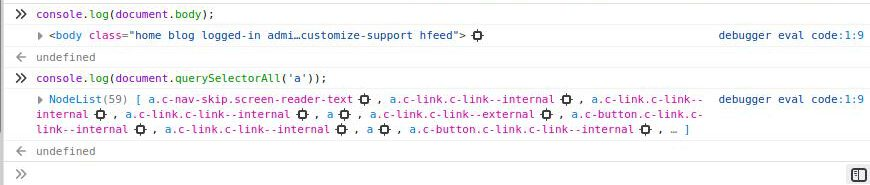
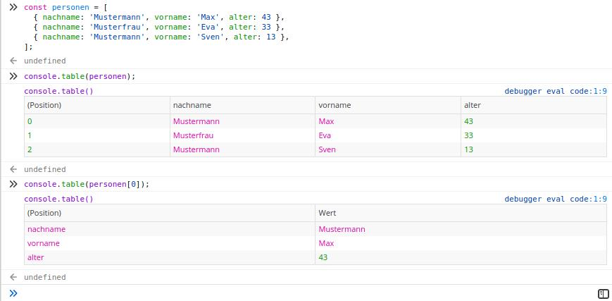
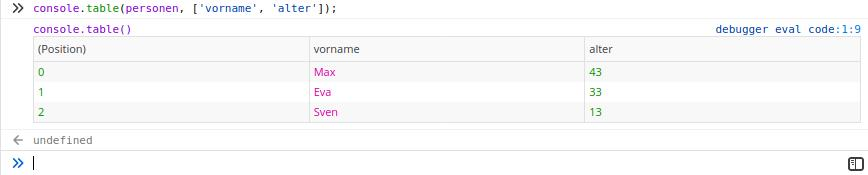
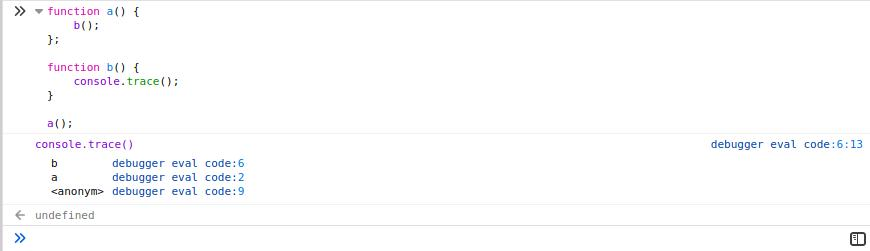
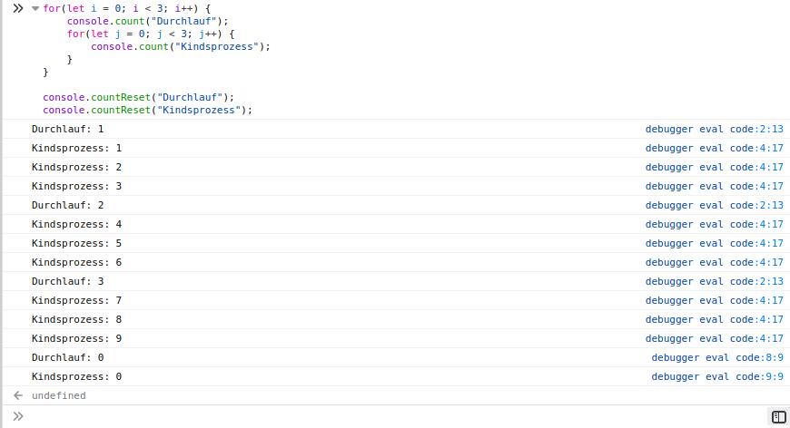
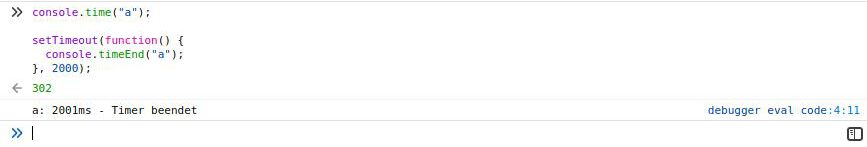
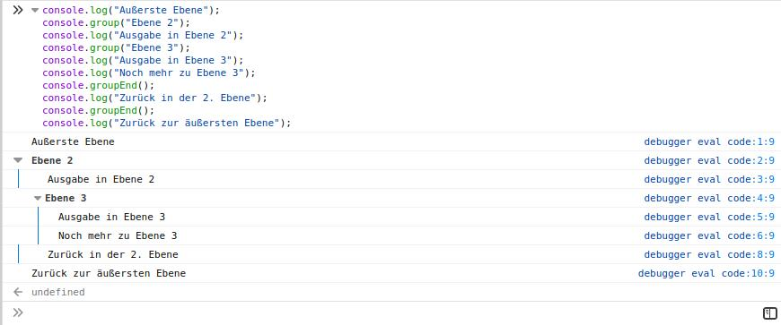
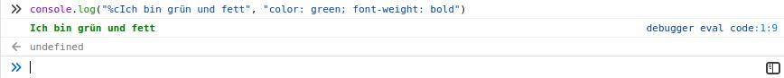
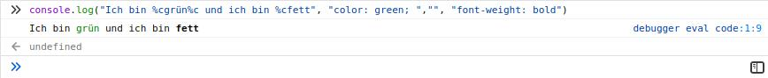

Zum Debugen von Javascipt wird der Befehl `console.log` sehr gerne verwendet. Dadurch werden Javascript Objekte in der Konsole des Browsers ausgegeben.

Neben `console.log` gibt es auch noch `console.warn` und `console.error`. Diese bieten die selbe Funktionalität, jedoch werden sie etwas anders dargestellt und können einfach gefiltert werden.

## Objekte anzeigen

Mit `console.log` kann man sich auch DOM Objekte anzeigen lassen.

Mit den folgenden Befehlen kann man sich eine oder mehrere DOM Objekte ausgeben lassen:

```
console.log(document.body);
console.log(document.querySelectorAll('a'));
```



Neben der Ausgabe der Objekte bieten die meisten Browser noch mehr Komfort. Die Objekte in der Konsolenausgabe werden beim Hovern hervorgehoben. Außerdem kann man sich das Element auch in der DOM Ansicht anzeigen lassen.

## Objekttabellen anzeigen

Neben einfachen Text und Objektausgaben können Arrays und Objekte mittels `[console.table](https://developer.mozilla.org/en-US/docs/Web/API/Console/table)` als Tabellen ausgegeben werden.

```
const personen = [
  { nachname: 'Mustermann', vorname: 'Max', alter: 43 },
  { nachname: 'Musterfrau', vorname: 'Eva', alter: 33 },
  { nachname: 'Mustermann', vorname: 'Sven', alter: 13 },
];

console.table(personen);
console.table(personen[0]);
```



Auf diese Art können Objekte einfach lesbar dargestellt werden. Es kann aber auch eine Einschränkung der ausgegebenen Spalten vorgenommen werden, falls man z.B. größere Objekte zur Hand hat, oder nur bestimmte Werte von Interesse sind.

```
console.table(personen, ['vorname', 'alter']);
```



## Funktionsaufrufe verfolgen

Möchte man wissen, von welchen Methoden zu einem Zeitpunkt eine Methode aufgerufen worden ist, so kann man das mittels `console.trace` zurückverfolgen.

```
function a() {
    b();
};

function b() {
    console.trace();
}

a();
```



Die Ausgabe ist dann von oben (tiefster Aufruf) nach unten (höchster Aufruf) zu lesen.

## Aufrufe zählen

Wenn man erfahren möchte, wie oft eine Funktion aufgerufen worden ist, dann kann man `console.count` dafür verwenden.

```
for(let i = 0; i < 3; i++) {
    console.count("Durchlauf");
    for(let j = 0; j < 3; j++) {
        console.count("Kindsprozess");
    }
}

console.countReset("Durchlauf");
console.countReset("Kindsprozess");
```



Jedes mal, wenn der Aufruf erreich wird, werden Zählername und aktueller Durchlauf ausgegeben.

Durch das Aufrufen con `console.countReset` wird der Zähler für den angegebenen Namen zurückgesetzt.

## Zeit messen

Man kann auch die Zeit messen, die von Aufruf a bis zum Aufruf b vergangen ist. Dafür verwendet man die Methodenkombination `console.time` und `console.timeEnd`

```
console.time("a");
...
console.timeEnd("a");
```



Diese Methode ist nicht sehr zuverlässig, da die Berechnung immer davon abhängt wie sehr der Computer mit anderen Berechnungen beschäftigt ist. Als grober Anhaltspunkt ist es aber dennoch sehr nützlich. Auch hier gilt: schlecht gemessen ist besser als gar nicht gemessen.

Optional kann auch zwischen dem Start und dem Ende die Funktion `console.timeLog` verwendet werden, um den aktuellen Wert des Timers auszugeben.

## Gruppieren von Ausgaben

Um Ausgaben einfacher in einem Kontext auszugeben können diese mit der Funktion `console.group` zusammengefasst werden. Es können beliebig viele Verschachtelungen stattfinden, jedoch ist die Lesbarkeit bei übermäßiger Verwendung nicht mehr gewährleistet.

```
console.log("Außerste Ebene");
console.group("Ebene 2");
console.log("Ausgabe in Ebene 2");
console.group("Ebene 3");
console.log("Ausgabe in Ebene 3");
console.log("Noch mehr zu Ebene 3");
console.groupEnd();
console.log("Zurück in der 2. Ebene");
console.groupEnd();
console.log("Zurück zur äußersten Ebene");
```



## Styling

Mit CSS Styling lässt sich noch mehr Leben in die Konsolen bringen und wichtige Elemente lassen sich als solche kennzeichnen.

Im folgendem Beispiel wird ein Stil auf die gesamte Ausgabe angewandt:

```
console.log("%cIch bin grün und fett", "color: green; font-weight: bold")
```



Als nächstes werden einzelne Stile auf einzelne Wörter angewandt:

```
console.log("Ich bin %cgrün%c und ich bin %cfett", "color: green; ","", "font-weight: bold")
```



Hierbei ist zu beachten, dass die Anzahl der Vorkommen von `%c` und die Anzahl der Optionen übereinstimmen müssen. Gibt es weniger Optionen als benötigt, so wird der Text nicht formatiert. Bei jedem Vorkommen von `%c` werden die zuvor angewandten Stile zurückgesetzt.

## Fazit

Die Konsolen-API ist ein sehr mächtiges Werkzeug, welches von den Meisten sehr einseitig benutzt wird. Dabei kann man diverse Darstellungsanpassungen vornehmen, Funktionsaufrufe nachverfolgen, Aufrufe zählen und Zeit messen.

Nicht alle Funktionen werden täglich benötigt, doch sollte man wissen das diese vorhanden sind und genutzt werden können.
