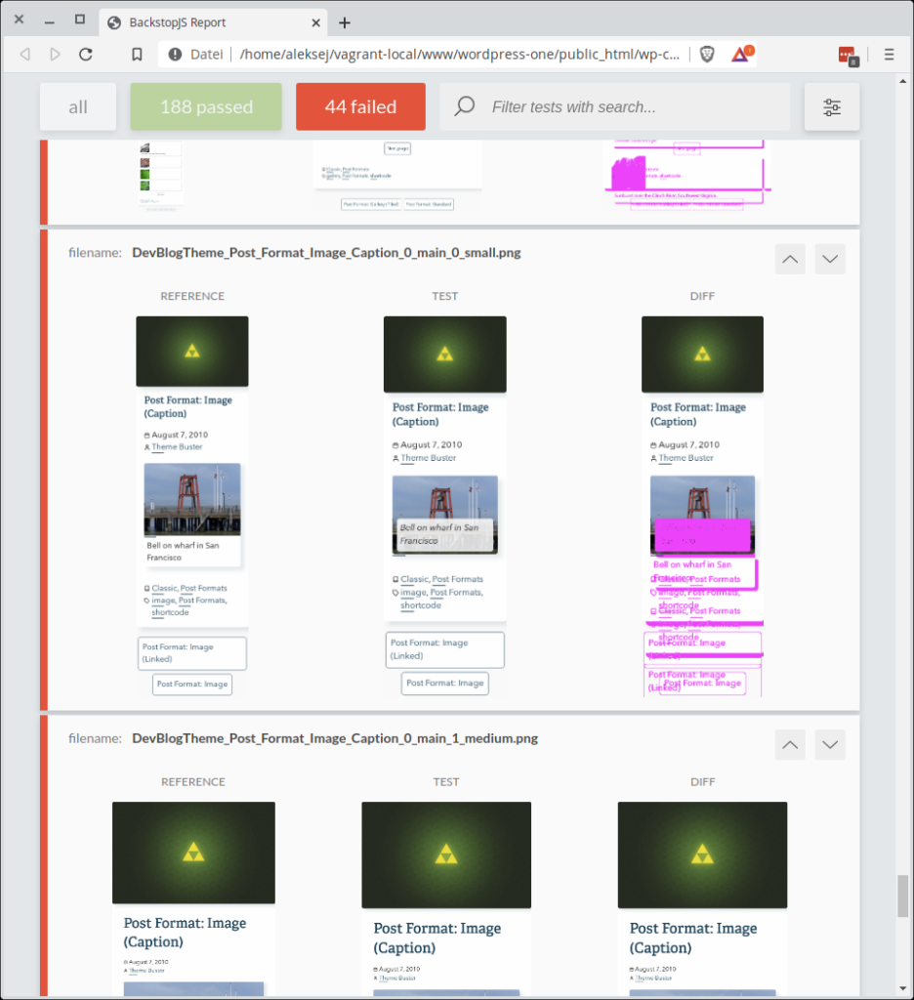
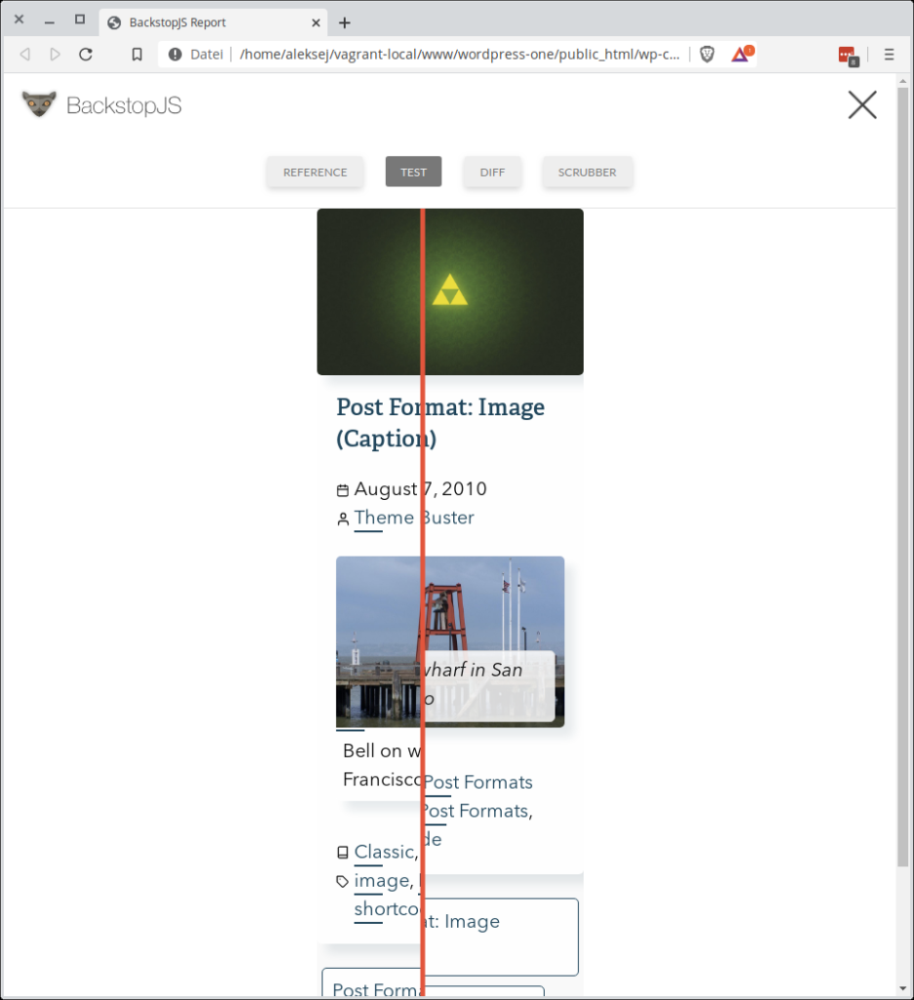
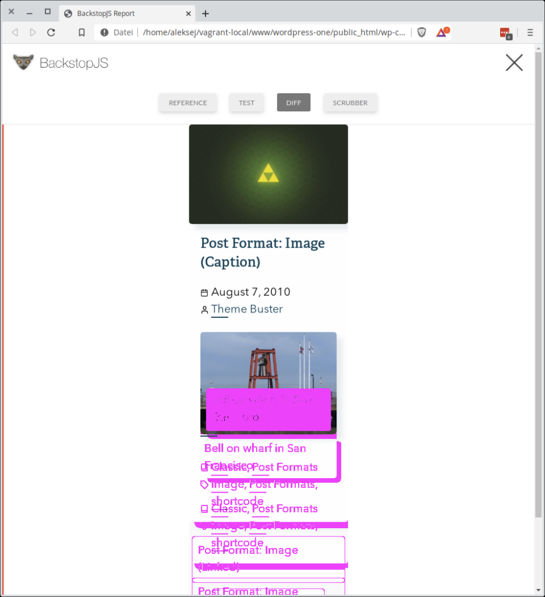

Das hier ist der erste Teil einer Serie in der ich den Nutzen, die Funktionsweise, Verwendung und Optimierungen für [BackstopJS](https://github.com/garris/BackstopJS) (später nur noch Backstop) erkläre.

## Was ist Backstop?

Backstop ist ein CLI Tool zum Testen von [visuellen Regressionen](https://de.wikipedia.org/wiki/Regressionstest) (Fehler die durch Veränderungen im Nachhinein dazukommen). Dazu wird in der Standardkonfiguration ein JSON Dokument angelegt, welches angibt auf welchen Seiten welche Elemente überprüft werden sollen. Von diesen Elementen werden dann Screenshots erstellt. Ist man mit seinem Arbeitsstand zufrieden bestätigt man die von Backstop erstellten Screenshots und kann dann nach neuen Änderungen erneut auf Änderungen überprüfen.

## Warum braucht man Backstop

Stellen wir uns folgende Situation vor: Ein neuer Entwickler fängt in einem Team an und muss Anpassungen an einer Webseite machen, die bereits eine Komplexität erreicht hat, die nur schwer von einer Person komplett überblickt werden kann. Der Entwickler passt CSS für die Linkdarstellung an. Nun kann man ohne Backstop nicht ohne weiteres sicherstellen, dass die Anpassung nicht auch Auswirkungen auf Bereiche hat, die eigentlich nicht angepasst werden sollten.

Für solch einen, aber auch viele andere Anwendungsfälle, braucht man einen Regressionstest. Man hat einen Ausgangszustand, verändert den Quellcode und stellt sicher, dass die Anpassungen keine unerwünschten Nebenwirkungen haben.

Zusätzlich kann man Anpassungen viel entspannter vornehmen, wenn man weiß, dass man unerwünschte Nebeneffekte rechtzeitig erkennen wird.

Zuallerletzt ist es immer viel besser während der Entwicklung Fehler zu bemerken, als vom Kunden darauf hingewiesen zu werden.

- 
    
    Backstop Test Übersicht
    
- 
    
    Backstop Einzeltest Schieber
    
- 
    
    Backstop Einzeltest Unterschied
    

## Was kann Backstop?

Backstop ist sehr gut dafür geeignet um auf statischen Seiten in einem Browser Veränderungen zu erkennen.

## Was kann Backstop nicht?

Leider gibt es [(noch)](https://github.com/garris/BackstopJS/issues/1142) keine Möglichkeit mehrere Browser (Chrome, Firefox, Edge_, Internet Explorer, Safari,_ …) auszuwählen und diese zu testen. Bis Version 4 gab es die Möglichkeit neben Chrome auch Firefox zu simulieren, seit der Version 4 jedoch werden nur noch 2 Chrome Engines (Chromy und Puppeteer) unterstützt.

In der Praxis bedeutet das, dass man eben “nur” Regressions- aber keine Funktions- und Integrationstests mit Backstop durchführen kann.

Eine weitere Schwachstelle ist die Darstellung komplexer Verhalten. Man kann zwar das Klicken auf mehrere Elemente simulieren, wenn jedoch mehr als ein Klick erforderlich ist, wird es schwierig passende Pausenzeiten zu definieren.

## Warum ich Backstop trotzdem empfehlen kann

Der große Vorteil von Backstop ist es, dass es mit Technologien arbeitet, die man in der Regel sowieso als Entwickler im Web Bereich kennt: JSON Dokumente und CSS Selektoren.

In meiner Erfahrung war es immer so, dass nach kürzester Zeit jeder Entwickler grundlegende Szenarios schreiben konnte.

Dabei macht es natürlich Sinn, dass einige wenige Personen sich viel Tiefer mit dem Tool beschäftigen, um komplexe Szenarios abzubilden.
